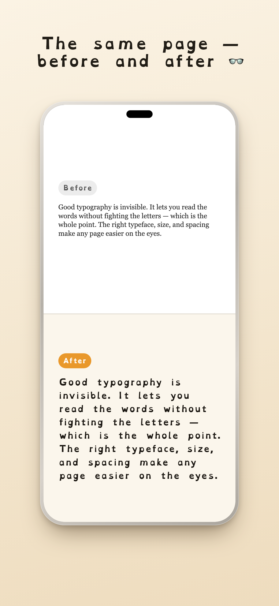
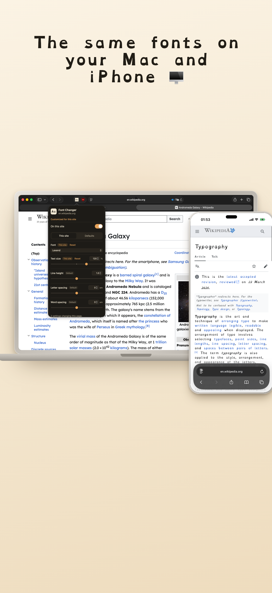
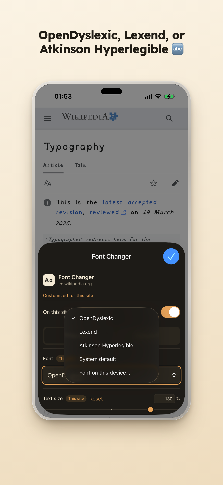
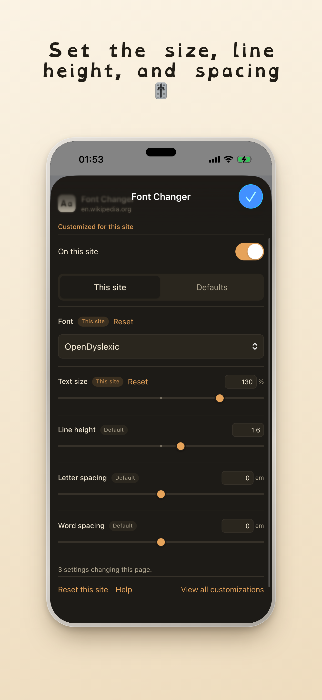
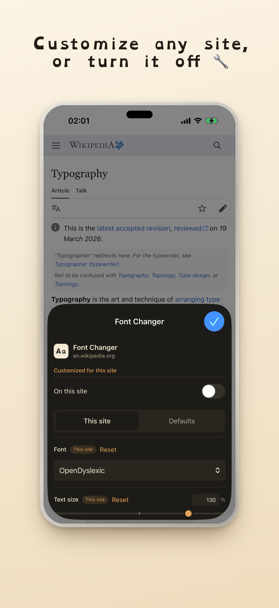

# Font Changer

Make any web page easier to read in Safari, on Mac and iPhone. Font Changer
swaps the page font to a dyslexia-friendly typeface like OpenDyslexic, Lexend,
or Atkinson Hyperlegible (or any font already on your device), and lets you tune
size, line height, and spacing, on by default everywhere with per-site control.
It leaves code blocks and icon fonts alone. Free, open source, and private by
design: no accounts, no tracking, nothing leaves your device.

Not affiliated with or endorsed by OpenDyslexic, Lexend, or Atkinson
Hyperlegible; it simply ships their fonts under their open-source licenses.

## Privacy

- No tracking, no analytics, no advertising, no accounts.
- Fonts are bundled in the app. The extension never loads anything from the
  internet.
- Your settings stay on this device (browser extension storage).
- It only restyles pages. It never reads or sends your browsing.

See [PRIVACY.md](PRIVACY.md).

## Accessibility

The popup itself is built to be usable: visible keyboard focus, labelled
switches and sliders, larger touch targets on iPhone and iPad, and a clear
per-site off switch.

## Licensing

- Code: MIT, see [LICENSE](LICENSE).
- Fonts: each under the SIL Open Font License 1.1, see
  [THIRD_PARTY_NOTICES.md](THIRD_PARTY_NOTICES.md) and `extension/fonts/`.
- Icon: original artwork.

## Found a bug or have an idea?

Tell me. Bug reports and suggestions are welcome:
[open a GitHub issue](https://github.com/spashii/font-changer/issues/new).

## More

[Development](DEVELOPMENT.md) · [Roadmap](ROADMAP.md) · [Contributing](CONTRIBUTING.md) · [Privacy](PRIVACY.md) · [Review notes](REVIEW_NOTES.md) · [Issues](https://github.com/spashii/font-changer/issues)
